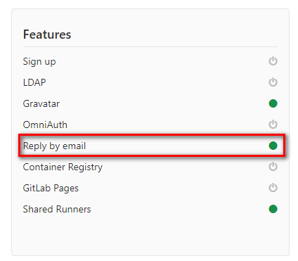

02Gitlab
===
源代码管理器选用Gitlab，新版（2018.4）的Gitlab已经集成了很多的功能了，涵盖CI/CD、Issues、K8s集群/Docker集群操作等。

在node01机器上安装部署Gitlab服务，Gitlab作为代码托管服务，所以需要注意备份、容灾等配置。

两种安装方式：
* [官方安装](https://about.gitlab.com/installation/#centos-7)
* [国内镜像安装](https://mirror.tuna.tsinghua.edu.cn/help/gitlab-ce/)

Gitlab官方源访问太慢，我们选择国内`清华大学镜像`进行安装，首先配置源：

```shell
cat>/etc/yum.repos.d/gitlab-ce.repo<<EOF
[gitlab-ce]
name=Gitlab CE Repository
baseurl=https://mirrors.tuna.tsinghua.edu.cn/gitlab-ce/yum/el\$releasever/
gpgcheck=0
enabled=1
EOF && \
yum makecache && \
yum install -y gitlab-ce
```
在此完成Gitlab的安装，但此时默认的一些配置还需要调整，比如[邮件配置](https://docs.gitlab.com/ce/administration/reply_by_email.html)，详细的邮件配置，参照官方文档介绍配置即可。
配置完成后，可以在Gitlab的Admin管理页面看到配置结果：



在Gitlab协同开发过程中，很多是依赖邮件沟通的，比如Pipelines的执行结果，Issues的处理等等。当然，我们也可以根据提供的Webhook来集成第三方的通信工具，比如钉钉。

## 自动备份

仓库需要日常的自动备份，进行容灾处理。Gitlab本身已经提供了备份导出的功能了，所以只要配置一个Job就行了。

在Crontab中增加以下语句：

```shell
0 5 * * 1 gitlab-rake gitlab:backup:create
```
以上代码将在每周的凌晨5店进行全量备份，备份完成后将生产一个.tar的包，默认存放在`/var/opt/gitlab/backups`。
可以通过修改配置文件调整存储的位置，也可以备份完成后将其自动上传到专用的NAS备份存储。

```shell
gitlab_rails['backup_path'] = '/var/opt/gitlab/backups' # 修改此处即可
```

到这里，Gitlab的基本配置就算完成了，开发人员可以将本地的git库提交到服务端了。

## 邮件配置

开启邮件，编辑配置文件`/etc/gitlab/gitlab.rb`

```shell
gitlab_rails['smtp_enable'] = true
gitlab_rails['smtp_address'] = "smtp.example.com"
gitlab_rails['smtp_port'] = 25
gitlab_rails['smtp_user_name'] = "gitlab@example.com"
gitlab_rails['smtp_password'] = "****"
gitlab_rails['smtp_domain'] = "smtp.example.com"
gitlab_rails['smtp_authentication'] = "login"
gitlab_rails['smtp_enable_starttls_auto'] = true
gitlab_rails['smtp_openssl_verify_mode'] = 'peer'

gitlab_rails['gitlab_email_from'] = 'gitlab@example.com'
gitlab_rails['gitlab_email_reply_to'] = 'gitlab@example.com'
```

```shell
 gitlab_rails['incoming_email_enabled'] = true
 gitlab_rails['incoming_email_address'] = "gitlab-incoming+%{key}@example.com"
 gitlab_rails['incoming_email_email'] = "gitlab@example.com"
 gitlab_rails['incoming_email_password'] = "***"
 gitlab_rails['incoming_email_host'] = "mail.example.com"
 gitlab_rails['incoming_email_port'] = 25
 gitlab_rails['incoming_email_ssl'] = false
 gitlab_rails['incoming_email_start_tls'] = false
 gitlab_rails['incoming_email_mailbox_name'] = "inbox"
 gitlab_rails['incoming_email_idle_timeout'] = 60
```

配置完成后，执行`gitlab-ctl reconfigure && gitlab-ctl restart`，重载配置

### 邮件配置测试

在GitLab服务器上，执行`gitlab-rails console`进入控制台，键入一下命令进行邮件测试

```shell
Notify.test_email('destination_email@address.com', 'Message Subject', 'Message Body').deliver_now
```
