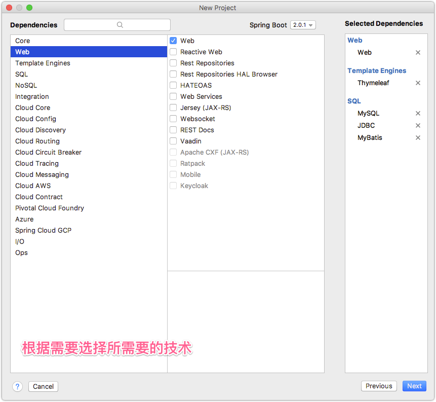
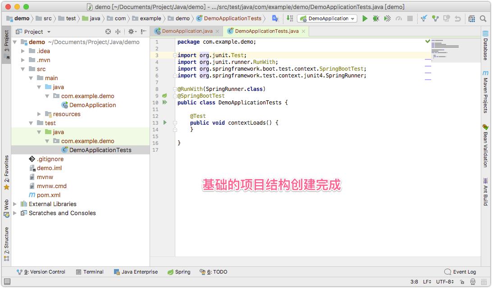
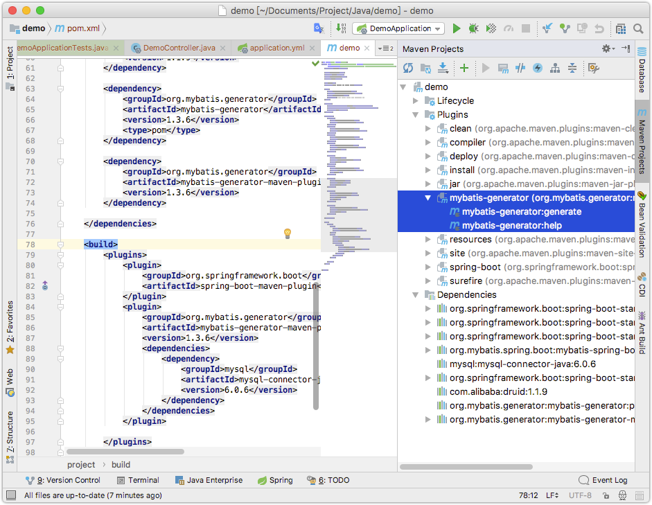
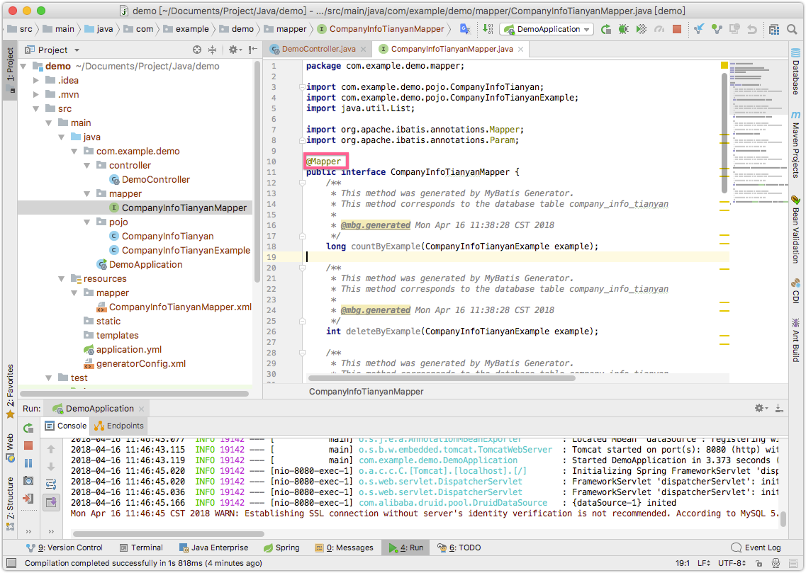

spring
===

## Spring Boot初始化

Spring Boot的好处多多，在IDEA上仅仅通过选择所需要的技术就可以完成大部分的配置工作。

完成后的目录结构

```shell
spring-demo
├── README.md
├── mvnw
├── mvnw.cmd
├── pom.xml
├── spring-demo.iml
└── src
    ├── main
    │   ├── java
    │   │   └── com
    │   │       └── jsj
    │   │           └── demo
    │   │               ├── DemoApplication.java
    │   │               ├── ServletInitializer.java
    │   │               ├── controller
    │   │               │   └── HotelController.java
    │   │               ├── mapper
    │   │               │   └── HotelInfoMapper.java
    │   │               └── pojo
    │   │                   ├── HotelInfo.java
    │   │                   └── HotelInfoExample.java
    │   └── resources
    │       ├── application.properties
    │       ├── application.yml
    │       ├── generatorConfig.xml
    │       ├── mapper
    │       │   └── HotelInfoMapper.xml
    │       ├── static
    │       └── templates
    └── test
        └── java
            └── com
                └── jsj
                    └── demo
                        └── DemoApplicationTests.java
```

在IDEA初始化Spring Boot项目







## 代码编写

### druid

使用`druid`来管理mysql连接池，druid是阿里巴巴发布的一款数据库连接池工具。

在`pox.xml`中添加

```xml
<dependency>
    <groupId>com.alibaba</groupId>
    <artifactId>druid</artifactId>
    <version>1.1.9</version>
</dependency>
```

添加默认的数据库连接配置，否则会出错，在`resource`文件夹下创建`application.yml`,删除`application.properties`,`application.yml`的语法更加简洁

```yml
server:
  port: 8080

spring:
  profiles:
    active: dev
  datasource:
    url: jdbc:mysql://127.0.0.1:3306/test_db
    username: root
    password: root
    driver-class-name: com.mysql.cj.jdbc.Driver
    type: com.alibaba.druid.pool.DruidDataSource
```

### 创建一个控制器

创建一个控制器，并创建一个方法：

```java
package com.example.demo.controller;

import org.springframework.boot.autoconfigure.EnableAutoConfiguration;
import org.springframework.web.bind.annotation.RequestMapping;
import org.springframework.web.bind.annotation.RestController;

@RestController
@EnableAutoConfiguration
@RequestMapping("/testboot")
public class DemoController {

    @RequestMapping("get")
    public String Get() {
        return "hello world!";
    }
}
```

如图，访问`http://localhost:8080/testboot/get`，将会输出`hello world!`


### 使用mybatis访问真实数据

#### 配置mybatis generator 插件

这里，我使用mybatis的插件 [mybatis generator](http://www.mybatis.org/generator/) 来生成mapping还有相关的基础代码

首先在`pox.xml`中加入依赖：

```xml
<dependency>
    <groupId>org.mybatis.generator</groupId>
    <artifactId>mybatis-generator</artifactId>
    <version>1.3.6</version>
    <type>pom</type>
</dependency>
<dependency>
    <groupId>org.mybatis.generator</groupId>
    <artifactId>mybatis-generator-maven-plugin</artifactId>
    <version>1.3.6</version>
</dependency>
```

然后加入maven插件，在`pox.xml`的`build > plugins`中加入节点:

```xml
<plugin>
    <groupId>org.springframework.boot</groupId>
    <artifactId>spring-boot-maven-plugin</artifactId>
</plugin>
<plugin>
    <groupId>org.mybatis.generator</groupId>
    <artifactId>mybatis-generator-maven-plugin</artifactId>
    <version>1.3.6</version>
    <dependencies>
        <dependency>
            <groupId>mysql</groupId>
            <artifactId>mysql-connector-java</artifactId>
            <version>6.0.6</version>
        </dependency>
    </dependencies>
</plugin>
```

这样，在IDEA的右侧Maven管理栏中就有了新的插件：



增加mybatis generator的配置`resources > generatorConfig.xml`,创建`generatorConfig.xml`

```xml
<?xml version="1.0" encoding="UTF-8" ?>
<!DOCTYPE generatorConfiguration
        PUBLIC "-//mybatis.org//DTD MyBatis Generator Configuration 1.0//EN"
        "http://mybatis.org/dtd/mybatis-generator-config_1_0.dtd">
<generatorConfiguration>
    <!--mybatis生成工具的帮助文档可以看：-->
    <!-- http://www.mybatis.org/generator/usage/mysql.html -->
    <context id="context" targetRuntime="MyBatis3">
        <!--设置编码格式-->
        <property name="javaFileEncoding" value="UTF-8"/>
        <jdbcConnection driverClass="com.mysql.cj.jdbc.Driver" connectionURL="jdbc:mysql://127.0.0.1:3306/test_db"
                        userId="root" password="root"/>
        <!--要生成的 domain 模块位置-->
        <javaModelGenerator targetPackage="com.example.demo.pojo" targetProject="src/main/java">
            <property name="enableSubPackages" value="true"/>
            <property name="trimStrings" value="true"/>
            <property name="comments" value="true"/>
        </javaModelGenerator>
        <!--要生成的 Mapper.xml 文件位置-->
        <sqlMapGenerator targetPackage="mapper" targetProject="src/main/resources">
            <property name="enableSubPackages" value="true"/>
        </sqlMapGenerator>
        <!--要生成的 Mapper 接口类-->
        <javaClientGenerator targetPackage="com.example.demo.mapper" targetProject="src/main/java" type="XMLMAPPER">
            <property name="enableSubPackages" value="false"/>
        </javaClientGenerator>

        <table tableName="company_info" enableCountByExample="true" enableDeleteByExample="true" enableSelectByExample="true" enableUpdateByExample="true">
            <generatedKey column="Id" sqlStatement="mysql" identity="true"/>
        </table>
    </context>
</generatorConfiguration>
```

这是一份最简单的配置，其他相关功能，需要访问官网查看。

到这里，配置就完成了，然后打开Maven面板，执行`mybatis-generator:generate`


执行成功后，将生成如图所示的三个文件夹以及其中的文件。

### 在控制器中使用mybatis

在`DemoController`中如下编码：


```java
package com.example.demo.controller;

import com.example.demo.mapper.CompanyInfoTianyanMapper;
import com.example.demo.pojo.CompanyInfoTianyan;
import com.example.demo.pojo.CompanyInfoTianyanExample;
import org.springframework.beans.factory.annotation.Autowired;
import org.springframework.boot.autoconfigure.EnableAutoConfiguration;
import org.springframework.web.bind.annotation.RequestMapping;
import org.springframework.web.bind.annotation.RestController;

import java.util.List;

@RestController
@EnableAutoConfiguration
@RequestMapping("/testboot")
public class DemoController {

    /**
     * 依赖注入
     */
    @Autowired
    private CompanyInfoTianyanMapper companyInfoTianyanMapper;

    @RequestMapping("get")
    public String Get() {
        return "hello world!";
    }

    @RequestMapping("list")
    public List<CompanyInfoTianyan> List() {
        CompanyInfoTianyanExample example = new CompanyInfoTianyanExample();
        example.createCriteria().andIdBetween(1, 3);  // 获取前三条数据
        List<CompanyInfoTianyan> list = companyInfoTianyanMapper.selectByExample(example);

        return list;
    }
}
```

在`mapper > CompanyInfoTianyanMapper`加入`@Mapper`注解



然后运行并访问`http://localhost:8080/testboot/list`即可得到三条数据：

