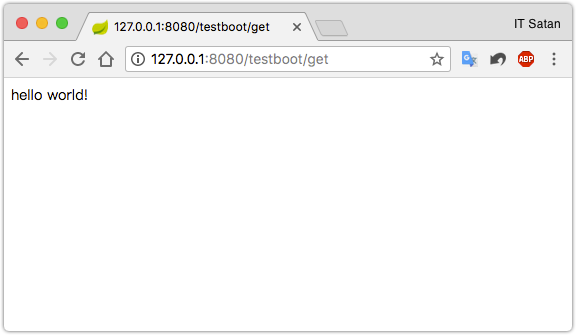

druid
===

## 配置

使用`druid`来管理mysql连接池，druid是阿里巴巴发布的一款数据库连接池工具。

在`pox.xml`中添加

```xml
<dependency>
    <groupId>com.alibaba</groupId>
    <artifactId>druid</artifactId>
    <version>1.1.9</version>
</dependency>
```

添加默认的数据库连接配置，否则会出错，在`resource`文件夹下创建`application.yml`,删除`application.properties`,`application.yml`的语法更加简洁

```yml
server:
  port: 8080

spring:
  profiles:
    active: dev
  datasource:
    url: jdbc:mysql://127.0.0.1:3306/test_db
    username: root
    password: root
    driver-class-name: com.mysql.cj.jdbc.Driver
    type: com.alibaba.druid.pool.DruidDataSource
```

## 创建一个控制器

创建一个控制器，并创建一个方法：

```java
package com.example.demo.controller;

import org.springframework.boot.autoconfigure.EnableAutoConfiguration;
import org.springframework.web.bind.annotation.RequestMapping;
import org.springframework.web.bind.annotation.RestController;

@RestController
@EnableAutoConfiguration
@RequestMapping("/testboot")
public class DemoController {

    @RequestMapping("get")
    public String Get() {
        return "hello world!";
    }
}
```

如图，访问`http://localhost:8080/testboot/get`，将会输出`hello world!`

