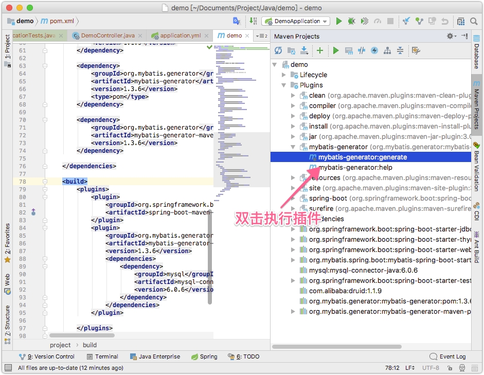
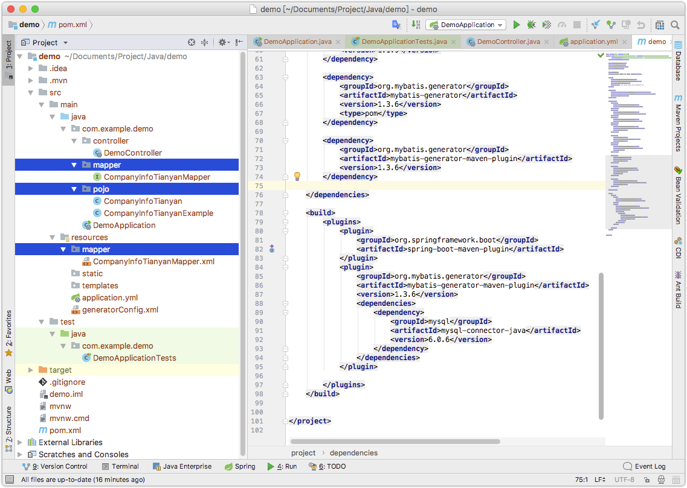

配置mybatis generator 插件
===

这里，我使用开源免费的插件 [mybatis generator](http://www.mybatis.org/generator/) 来生成mapping还有相关的基础代码

首先在`pox.xml`中加入依赖：

```xml
<dependency>
    <groupId>org.mybatis.generator</groupId>
    <artifactId>mybatis-generator</artifactId>
    <version>1.3.6</version>
    <type>pom</type>
</dependency>
<dependency>
    <groupId>org.mybatis.generator</groupId>
    <artifactId>mybatis-generator-maven-plugin</artifactId>
    <version>1.3.6</version>
</dependency>
```

然后加入maven插件，在`pox.xml`的`build > plugins`中加入节点:

```xml
<plugin>
    <groupId>org.springframework.boot</groupId>
    <artifactId>spring-boot-maven-plugin</artifactId>
</plugin>
<plugin>
    <groupId>org.mybatis.generator</groupId>
    <artifactId>mybatis-generator-maven-plugin</artifactId>
    <version>1.3.6</version>
    <dependencies>
        <dependency>
            <groupId>mysql</groupId>
            <artifactId>mysql-connector-java</artifactId>
            <version>6.0.6</version>
        </dependency>
    </dependencies>
</plugin>
```

这样，在IDEA的右侧Maven管理栏中就有了新的插件：


增加mybatis generator的配置`resources > generatorConfig.xml`,创建`generatorConfig.xml`

```xml
<?xml version="1.0" encoding="UTF-8" ?>
<!DOCTYPE generatorConfiguration
        PUBLIC "-//mybatis.org//DTD MyBatis Generator Configuration 1.0//EN"
        "http://mybatis.org/dtd/mybatis-generator-config_1_0.dtd">
<generatorConfiguration>
    <!-- http://www.mybatis.org/generator/usage/mysql.html -->
    <context id="context" targetRuntime="MyBatis3">
        <!--设置编码格式-->
        <property name="javaFileEncoding" value="UTF-8"/>
        <jdbcConnection driverClass="com.mysql.cj.jdbc.Driver" connectionURL="jdbc:mysql://127.0.0.1:3306/test_db"
                        userId="root" password="root"/>
        <!--要生成的 domain 模块位置-->
        <javaModelGenerator targetPackage="com.example.demo.pojo" targetProject="src/main/java">
            <property name="enableSubPackages" value="true"/>
            <property name="trimStrings" value="true"/>
            <property name="comments" value="true"/>
        </javaModelGenerator>
        <!--要生成的 Mapper.xml 文件位置-->
        <sqlMapGenerator targetPackage="mapper" targetProject="src/main/resources">
            <property name="enableSubPackages" value="true"/>
        </sqlMapGenerator>
        <!--要生成的 Mapper 接口类-->
        <javaClientGenerator targetPackage="com.example.demo.mapper" targetProject="src/main/java" type="XMLMAPPER">
            <property name="enableSubPackages" value="false"/>
        </javaClientGenerator>

        <table tableName="company_info" enableCountByExample="true" enableDeleteByExample="true" enableSelectByExample="true" enableUpdateByExample="true">
            <generatedKey column="Id" sqlStatement="mysql" identity="true"/>
        </table>
    </context>
</generatorConfiguration>
```

这是一份最简单的配置，其他相关功能，需要访问[官网](http://www.mybatis.org/generator/usage/mysql.html)查看。

到这里，配置就完成了，然后打开Maven面板，执行`mybatis-generator:generate`





执行成功后，将生成如图所示的三个文件夹以及其中的文件。