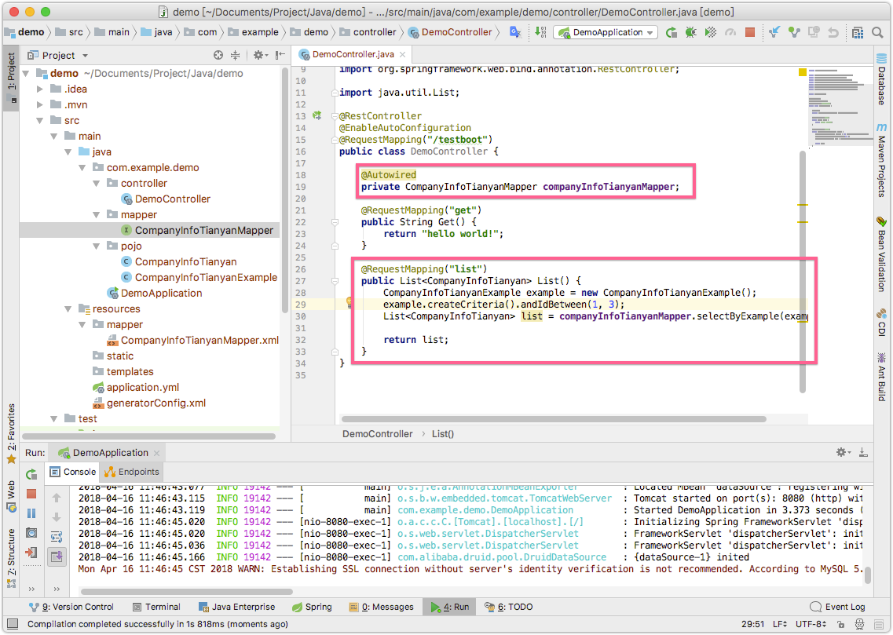
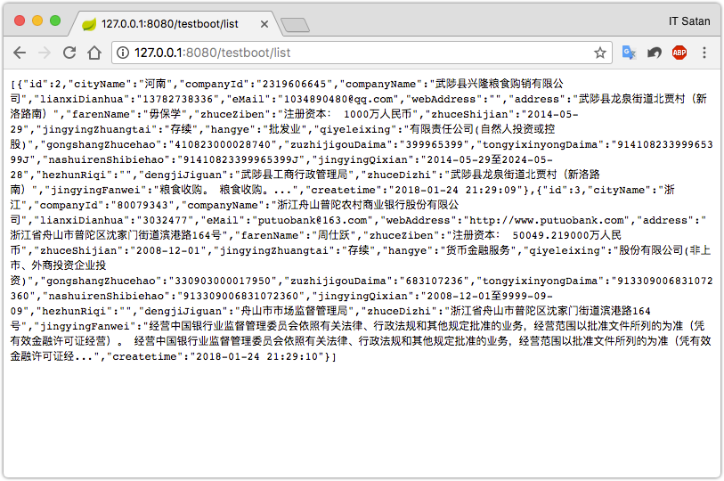

使用mybatis访问真实数据
===

## 在控制器中使用mybatis

在`DemoController`中如下编码：



```java
package com.example.demo.controller;

import com.example.demo.mapper.CompanyInfoTianyanMapper;
import com.example.demo.pojo.CompanyInfoTianyan;
import com.example.demo.pojo.CompanyInfoTianyanExample;
import org.springframework.beans.factory.annotation.Autowired;
import org.springframework.boot.autoconfigure.EnableAutoConfiguration;
import org.springframework.web.bind.annotation.RequestMapping;
import org.springframework.web.bind.annotation.RestController;

import java.util.List;

@RestController
@EnableAutoConfiguration
@RequestMapping("/testboot")
public class DemoController {

    /**
     * 依赖注入
     */
    @Autowired
    private CompanyInfoTianyanMapper companyInfoTianyanMapper;

    @RequestMapping("get")
    public String Get() {
        return "hello world!";
    }

    @RequestMapping("list")
    public List<CompanyInfoTianyan> List() {
        CompanyInfoTianyanExample example = new CompanyInfoTianyanExample();
        example.createCriteria().andIdBetween(1, 3);  // 获取前三条数据
        List<CompanyInfoTianyan> list = companyInfoTianyanMapper.selectByExample(example);

        return list;
    }
}
```

在`mapper > CompanyInfoTianyanMapper`加入`@Mapper`注解


然后运行并访问`http://localhost:8080/testboot/list`即可得到三条数据：

